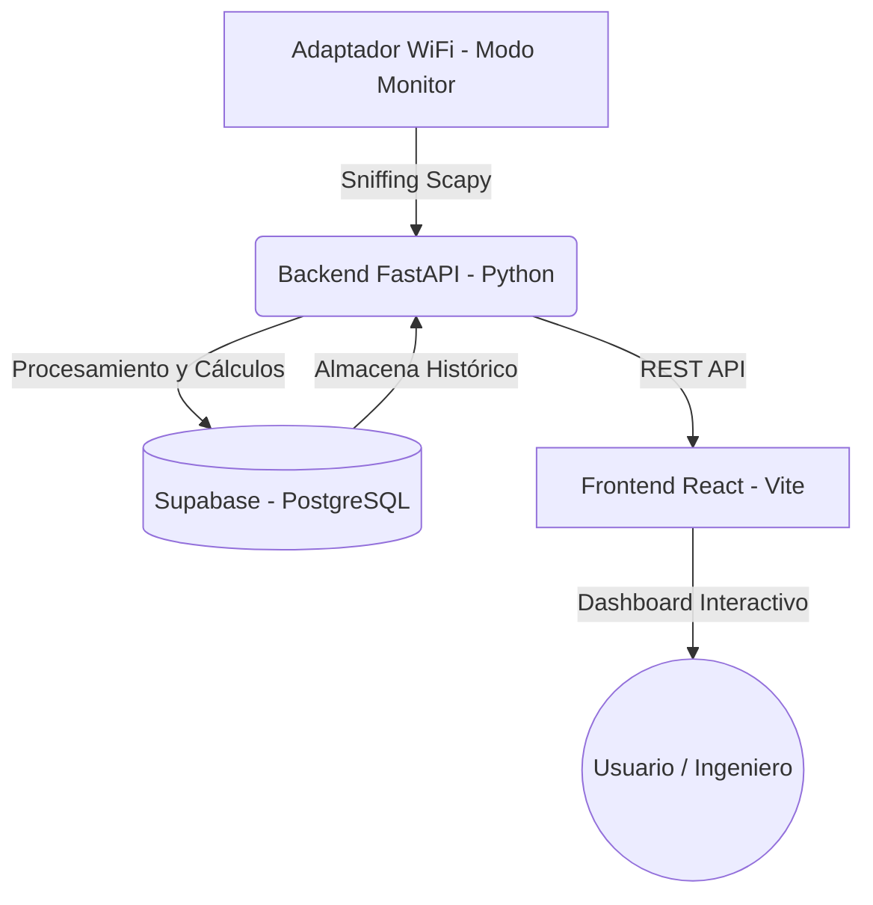
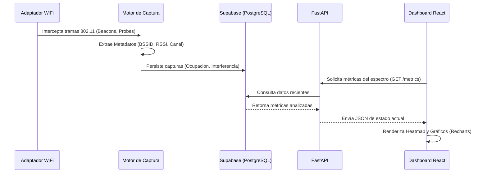

# AeroScan - Sistema de Análisis Espectral WiFi

AeroScan es una herramienta de diagnóstico orientada a la ingeniería de redes. Permite la captura y análisis del espectro radioeléctrico en redes inalámbricas WiFi (2.4 GHz y 5 GHz) para detectar problemas de rendimiento, congestión e interferencia.

## Arquitectura del Proyecto

El sistema se divide en un backend encargado de la captura de bajo nivel (usando WSL2 para el modo monitor) y una base de datos en Supabase, además de un frontend interactivo construido en React.

## Flujo de Datos (Data Flow)

A continuación se detalla cómo fluye la información desde la captura física hasta la visualización en el dashboard web.

## Pila Tecnológica (Tech Stack)

* **Frontend**: React (Vite), TailwindCSS, Bootstrap Icons, Recharts, Tipografía Outfit.
* **Backend**: Python 3, FastAPI, Scapy (para sniffing de paquetes).
* **Base de Datos**: PostgreSQL alojado en Supabase.
* **Infraestructura de Captura**: WSL2 (con `usbipd` para passthrough de USB) o entorno Linux nativo.
